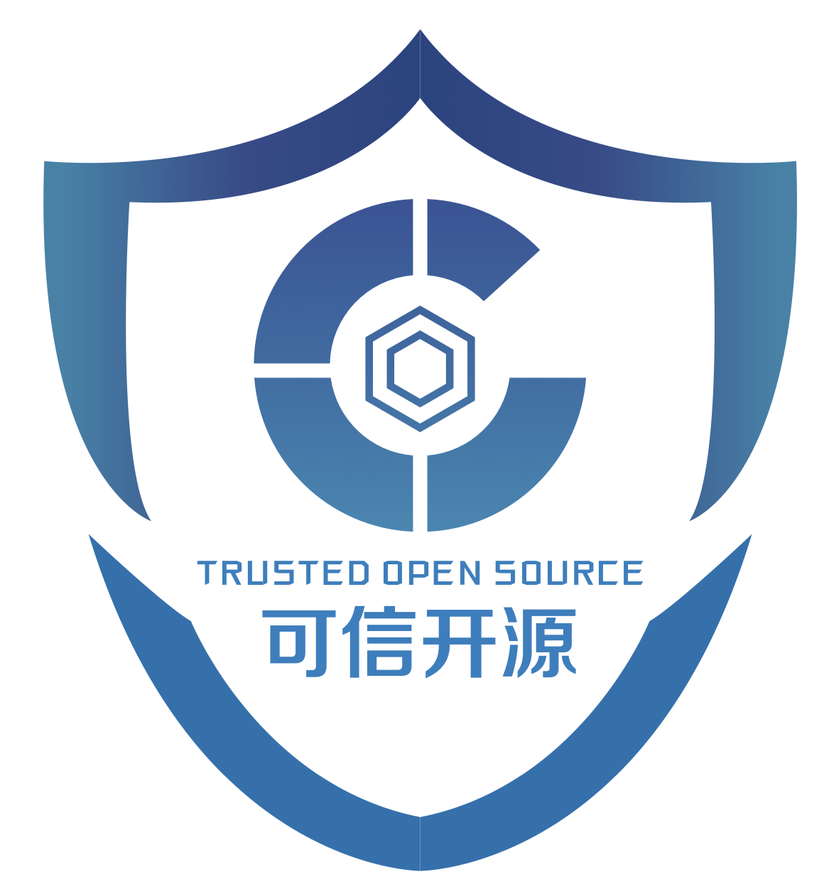
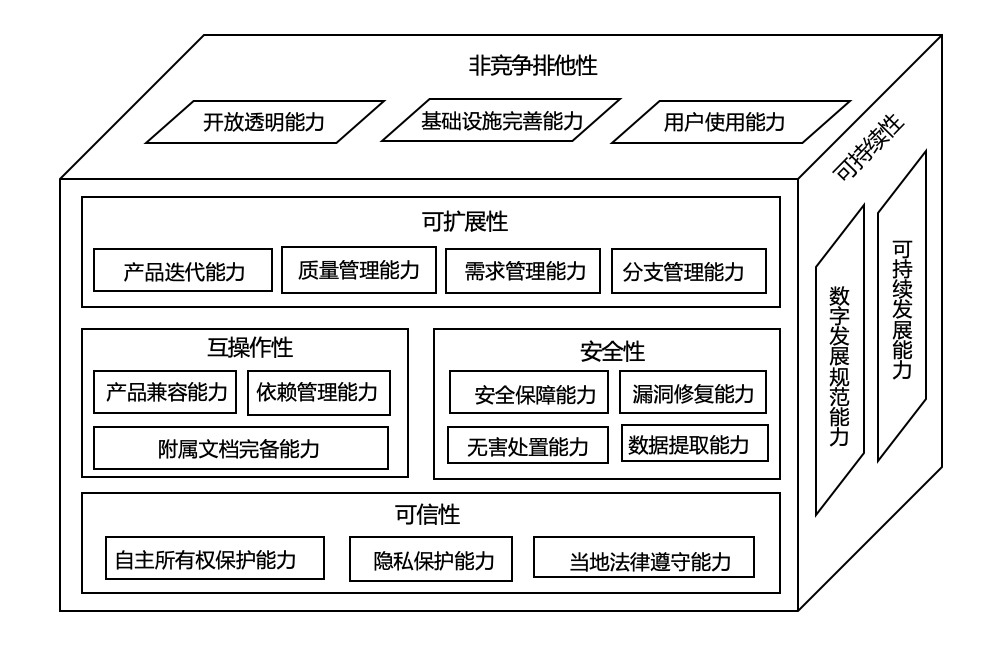
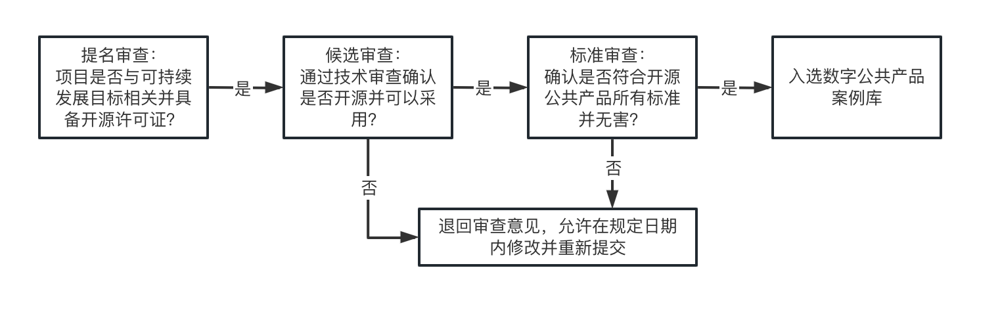

[![CC BY-SA 4.0][cc-by-sa-shield]](LICENSE)

  

# Digital Public Goods 数字公共产品

The digital public goods database of China Academy of Information and Communications Technology(CAICT) is established by the trusted open source team of the cloud computing and big data research institute of CAICT. The database includes digital public goods that meet the DPG standards of CAICT. CAICT’s DPG Standard follows the definition of digital public goods set by the UN Secretary-General in the [2020 Roadmap for Digital Cooperation](https://www.un.org/en/content/digital-cooperation-roadmap/): *digital public goods must be open source software, open data, open AI models, open standards, and open content that adhere to privacy and other applicable laws and best practices, do no harm, and help attain the Sustainable Development Goals (SDGs).* Our standard is based on the [DPG standard](https://digitalpublicgoods.net/standard/) of the [Digital Public Goods Alliance](https://digitalpublicgoods.net) (DPGA) and defines six capability dimensions.

中国信通院数字公共产品数据库是由中国信通院云计算与大数据研究所可信开源团队建立。数据库收录了符合中国信通院数字公共产品标准的数字公共产品。中国信通院数字公共产品标准认可联合国在[2020年数字合作路线图](https://www.un.org/en/content/digital-cooperation-roadmap/)中设定的数字公共产品定义：*数字公共产品必须是开源的遵守隐私和其他适用法律和最佳实践的软件、开放数据、开放人工智能模型、开放标准和开放内容，不会造成伤害，并有助于实现可持续发展目标 (SDG)。* 我们的标准在[数字公共产品联盟](https://digitalpublicgoods.net)的[数字公共产品标准](https://digitalpublicgoods.net/standard/)的基础上，定义为了六个能力维度。

## 📃 DPG Standard of CAICT 中国信通院数字公共产品标准

CAICT DPG Standard defines the capabilities that digital public goods should have, which are divided into six dimensions, including **non-competitive & non-exclusive, interoperability, security, credibility, scalability, and sustainability**. 

**1. Non-compete & non-exclusive**

Non-competitive & non-exclusive requires that digital public goods do not exclude anyone from consumption in different application scenarios, and at the same time require that there is no conflict of interest between users. It includes open and transparent capabilities, infrastructure improvement capabilities, and user usage capabilities.

**2. Scalability**

Scalability requires that digital public goods have the ability to add new product functions and modify original functions, including product iteration capabilities, quality management capabilities, demand management capabilities, and branch management capabilities.

**3. Interoperability**

Interoperability refers to the operation and information-sharing capabilities that digital public goods should have in different computer systems, networks, and other environments, including product compatibility, dependency management capabilities, and completeness of auxiliary documents.

**4. Security**

Security refers to the security benchmarks that digital public goods should meet, including security assurance capabilities, vulnerability repair capabilities, harmless disposal capabilities, and data extraction capabilities.

**5. Credibility**

Credibility means that digital public goods ensure the trust of users through the protection of users' privacy, rights and interests, and compliance. It includes the ability to protect independent ownership, privacy protection, and compliance with local laws.

**6. Sustainability**

Sustainability requires that digital public goods meet the goals of sustainable development, including digital development normative capabilities and sustainable development capabilities.

*More detailed content about the CAICT DPG Standard will be uploaded after release, please continue to focus!*

中国信通院数字公共产品标准对数字公共产品所应具有的能力进行了定义，共分为六个维度，由**非竞争排他性、互操作性、安全性、可信性、可扩展性、可持续性**组成。数字公共产品能力框架如下图所示。

  

**1.	非竞争排他性**

非竞争排他性要求数字公共产品在不同应用场景下不排除任何人进行消费，同时要求使用对象之间不存在利益冲突，包括开放透明能力，基础设施完善能力和用户使用能力。

**2.	可扩展性**

可扩展性要求数字公共产品具备增加新的产品功能与修改原有功能的能力，包括产品迭代能力，质量管理能力，需求管理能力，分支管理能力。

**3.	互操作性**

互操作性是指数字公共产品在不同的计算机系统、网络等环境下应具备的运行和信息共享能力，包括产品兼容能力，依赖管理能力和附属文档完备能力。

**4.	安全性**

安全性是指数字公共产品应符合的安全基准，包括安全保障能力，漏洞修复能力，无害处置能力和数据提取能力。

**5.	可信性**

可信性是指数字公共产品通过对用户的隐私、权益等方面保护和对当地法律遵守来保证产品用户信任度，包括自主所有权保护能力，隐私保护能力和当地法律遵守能力。

**6.	可持续性**

可持续性要求数字公共产品符合可持续发展目标，包括数字发展规范能力与可持续发展能力。

*有关CAICT DPG标准更详细的内容，将在发布后上传，欢迎持续关注！*

## ✅ Application Process 申请流程

We encourage excellent digital public goods to apply to become CAICT-certified digital public goods and join the CAICT DPG database.

We also have a [three-stage review mechanism similar to DPGA](https://github.com/DPGAlliance/DPG-Standard#-application-of-the-dpg-standard).

1. First, we use a questionnaire to investigate whether applied digital public goods are consistent with the [UN Sustainable Development Goals](https://sdgs.un.org/goals) and have relevant os licenses. Digital public goods that pass the questionnaire will be nominated.

2. Secondly, we examine whether the nominated digital public goods are open source and can be used through technical review, and the digital public goods that pass the technical review will be candidates.

3. Finally, we use the CAICT DPG standard to review whether the candidate digital public goods meet all the content of the standard. The digital public goods that pass the standard review will be released as CAICT-certified DPG. Excellent Cases will be invited to give speeches and demonstrations in the exchange activities related to the digital public goods of CAICT.

Note: Digital public goods that fail each link will receive feedback, allowing revision and resubmission within the specified date.

我们鼓励优秀的数字公共产品申请成为CAICT认证的数字公共产品，加入CAICT数字公共产品库。

中国信通院数字公共产品审查流程是一个类似于[DPGA的三阶段审查机制](https://github.com/DPGAlliance/DPG-Standard#-application-of-the-dpg-standard)。

首先，我们通过问卷调查申请的数字公共产品是否与[联合国可持续发展目标](https://sdgs.un.org/goals)一致，并具备相关开源许可证，通过问卷调查的数字公共产品将获得提名。

其次，我们通过技术审查被提名的数字公共产品是否开源并能够被使用，通过技术审查的数字公共产品将作为候选。

最后，我们通过中国信通院数字公共产品标准审查候选的数字公共产品是否符合标准的所有内容，通过标准审查的数字公共产品将作为中国信通院数字公共产品研究重要成果汇编成册并公开发布，优秀案例将会被邀请在中国信通院数字公共产品相关交流活动中进行宣讲和展示。

注：每一环节没有通过的数字公共产品将收到反馈意见，允许在规定日期内修改并重新提交。

## 📦 Cases 产品库

We have created [CAICT DPG database](https://github.com/CAICTDPG/Digital-Public-Goods/tree/main/Digital%20Public%20Goods%20%20Registration%20Form), where you can learn more about each digital public goods.

我们制作了[中国信通院数字公共产品库](https://github.com/CAICTDPG/Digital-Public-Goods/tree/main/Digital%20Public%20Goods%20%20Registration%20Form)，您可以在案例库中了解有关数字公共产品的详细信息。

## 📁 DPG Reports 数字公共产品洞察报告

You can access the CAICT DPG Insights Report through this link. We will upload the report in the future.

您可以通过此链接访问中国信通院数字公共产品洞察报告。报告会在后续及时分布与更新，欢迎及时关注。

## 🎙️ Conference 会议发布 

China Academy of Information and Communications Technology will regularly hold [conferences](conference/21stApr2023_Beijing.md) related to digital public goods and release our contribution in digital public goods. You are welcome to attend our conferences!

中国信通院将定期举办数字公共产品[相关会议](conference/21stApr2023_Beijing.md)，发布数字公共产品成果，欢迎您关注并参加我们的会议！

## 😊 Code of Conduct 行为准则

We hope that through our efforts, we can promote the development and implementation of digital public goods in China and the world, build diverse and high-quality communities, and achieve the sustainable development goals of the United Nations. We will publish more codes of conduct in the future.

我们希望通过努力，推动中国乃至世界数字公共产品的发展和落地，建立多元、高质量的社区，实现联合国可持续发展的目标。更多的行为守则我们会在后续发布。

## ⚖️ Governance 治理

We envision the management of digital public goods database around the CAICT DPG standard in an open, transparent and accessible manner. All of our governance records can be found on this page.

我们希望以开放、透明和可访问的方式围绕中国信通院数字公共产品标准对数字公共产品数据库进行管理。您可以在本网页中找到我们所有的记录。

## 📄 License 许可证

This repository is primarily content, and it is licensed under a [Creative Commons Attribution ShareAlike 4.0 International License](LICENSE).

此仓库以文本内容为主，根据[Creative Commons Attribution ShareAlike 4.0 International License](LICENSE)获得许可。

[![CC BY-SA 4.0][cc-by-sa-image]](LICENSE)

[cc-by-sa-shield]: https://img.shields.io/badge/License-CC%20BY--SA%204.0-lightgrey.svg
[cc-by-sa-image]: https://licensebuttons.net/l/by-sa/4.0/88x31.png
